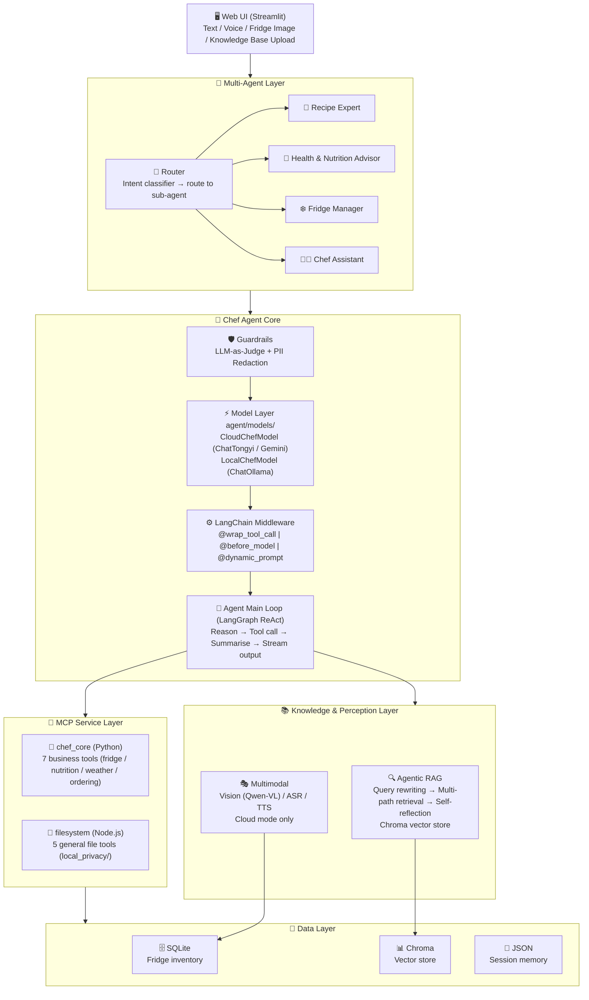
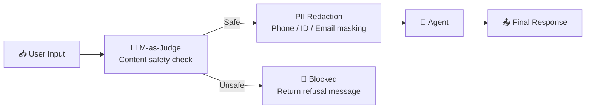
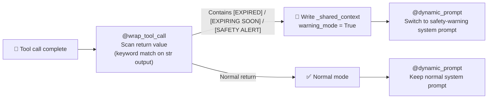
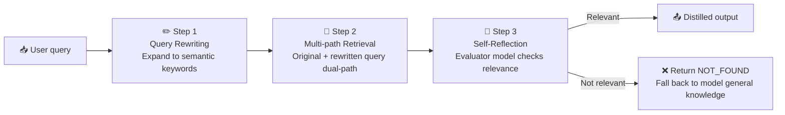
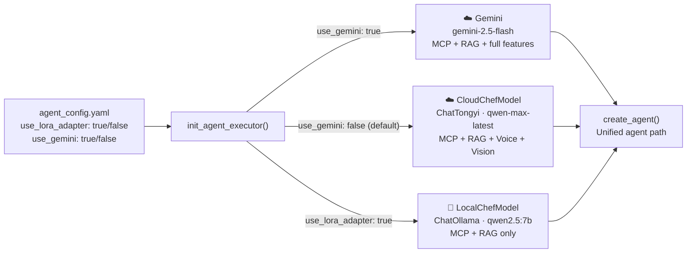
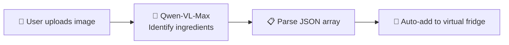
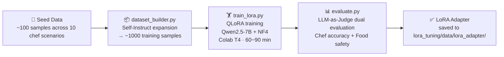

# 🍽️ AI Chef Agent — Multi-Agent Private Chef System

> A multimodal AI private chef system built on **LangChain + LangGraph + MCP**.
> Features fridge scanning, voice interaction, personalised recipe recommendations, and food safety alerts.
> Includes a **multi-agent routing architecture**, **guardrails (LLM-as-Judge + PII redaction)**, and a full **QLoRA fine-tuning pipeline** (Qwen2.5-7B + LLM-as-Judge evaluation).
> Supports seamless switching between cloud (Qwen / Gemini) and local (Ollama) modes.

---

## 📖 Table of Contents

- [✨ Features](#-features)
- [🏗️ System Architecture](#️-system-architecture)
- [📁 Project Structure](#-project-structure)
- [🚀 Quick Start](#-quick-start)
- [🔧 Module Overview](#-module-overview)
- [⚙️ Configuration](#️-configuration)
- [🧠 LoRA Fine-tuning](#-lora-fine-tuning)
- [🛠️ Tech Stack](#️-tech-stack)

---

## ✨ Features

| Feature | Description |
|---------|-------------|
| 🍜 **Smart Recipe Recommendations** | Combines fridge inventory, local weather, and health reports to give highly personalised recipe suggestions |
| 🔀 **Multi-Agent Routing** | Intent classifier routes requests to specialised sub-agents: Recipe Expert, Health Advisor, Fridge Manager, General Chef |
| 🛡️ **Guardrails** | Two-layer safety system: LLM-as-Judge content filter + regex-based PII redaction before any response is returned |
| 📷 **Fridge Vision Scanning** | Upload a fridge photo — Qwen-VL-Max identifies ingredients and adds them to the virtual fridge automatically |
| ⚠️ **Food Safety Alerts** | Detects expiring / expired items, blocks allergen risks, and dynamically switches to a safety-warning system prompt |
| 🎙️ **Voice Interaction** | Speech-to-text (ASR) and text-to-speech (TTS) for hands-free operation |
| 🔍 **Agentic RAG** | 3-step pipeline: query rewriting → multi-path retrieval → self-reflection, for precise recipe and nutrition lookup |
| 🔒 **Local Privacy Protection** | Health reports and private recipes stay local — never uploaded to any cloud RAG store |
| 🧠 **Session Memory** | Multi-turn conversation context with sliding-window message history |
| ☁️🔌 **Cloud / Local Dual Mode** | One config line to switch: cloud quota exhausted? Fall back to local Ollama seamlessly — MCP and RAG still work |
| 🔬 **QLoRA Fine-tuning Pipeline** | Self-Instruct data generation → QLoRA training → LLM-as-Judge evaluation, end-to-end |

---

## 🏗️ System Architecture

### Overall Architecture



### 🛡️ Guardrails Flow



### ⚡ Middleware Alert Pipeline



> **Implementation note:** `@wrap_tool_call`, `@before_model`, and `@dynamic_prompt` each receive different `runtime` instances. They share state via a module-level `_shared_context` dict. Warning mode resets automatically at the start of each conversation turn to prevent stale alerts from bleeding into the next round.

### 🔍 Agentic RAG Pipeline



### 🔀 Cloud / Local Dual Mode



---

## 📁 Project Structure

```
ai_chef_agent/
├── 🤖 agent/
│   ├── models/
│   │   ├── cloud_model.py         # Cloud model wrapper (ChatTongyi / DashScope)
│   │   ├── local_model.py         # Local model wrapper (ChatOllama / Ollama)
│   │   └── gemini_model.py        # Google Gemini model wrapper
│   ├── chef_agent.py              # Main entry: Agent init, streaming output, terminal REPL
│   ├── mcp_client_tools.py        # MCP dual-service connector and tool loader
│   ├── mcp_server.py              # Custom MCP server (7 business tools)
│   ├── state_manager.py           # Session memory manager (persistent + sliding window)
│   ├── middleware.py              # LangChain middleware (monitoring / alerts / dynamic prompts)
│   ├── guardrails.py              # Two-layer safety: LLM-as-Judge + PII redaction
│   ├── multi_agent_graph.py       # LangGraph multi-agent StateGraph
│   └── router.py                  # Intent classifier and agent router
│
├── ⚙️  conf/
│   ├── __init__.py                # Config loader
│   ├── agent_config.yaml          # Core params: model, RAG, MCP, LoRA, fridge, Gemini
│   └── prompt_config.yaml         # All prompts in one place
│
├── 🔬 lora_tuning/                # QLoRA fine-tuning pipeline
│   ├── dataset_builder.py         # Self-Instruct data generation (~1000 chef instruction samples)
│   ├── train_lora.py              # QLoRA training script (Qwen2.5-7B + NF4 quantization)
│   ├── evaluate.py                # LLM-as-Judge evaluation (chef accuracy + food safety)
│   └── colab/
│       ├── colab_runner.ipynb     # Colab one-click training notebook
│       ├── merge.ipynb            # LoRA adapter merge + GGUF export (Kaggle)
│       └── requirements_lora.txt  # Training-only dependencies (bitsandbytes, etc.)
│
├── 🔍 rag/
│   ├── agentic_rag_core.py        # 3-step Agentic RAG core pipeline
│   └── vector_stores.py           # Chroma vector store management (txt / pdf / docx)
│
├── 🧊 fridge_manager/
│   ├── fridge_db.py               # SQLite fridge database (inventory + user preferences)
│   └── warning_system.py          # Expiry alerts and allergen blocking
│
├── 🎭 multimodal/
│   ├── vision_parser.py           # Fridge image recognition (Qwen-VL-Max)
│   └── audio_handler.py           # ASR (speech-to-text) + TTS (CosyVoice)
│
├── 🖥️  web/
│   └── app_ui.py                  # Streamlit Web UI (auto-adapts to cloud / local mode)
│
├── 🛠️  utils/
│   └── logger_handler.py          # Unified logging + tool call decorator
│
├── 🔒 local_privacy/              # Local-only private files (never uploaded to cloud RAG)
│   ├── health_report_2026.txt     # Personal health report
│   └── grandma_secret_soup.txt    # Private family recipe
│
├── 💾 data/
│   ├── fridge.db                  # SQLite fridge database file
│   ├── chroma_db/                 # Chroma vector store
│   ├── uploads/                   # User-uploaded knowledge base documents
│   └── audio/                     # TTS-generated audio files
│
├── 🧠 memory_sessions/            # Session history (JSON persistence)
├── .env.example                   # Environment variable template
└── requirements.txt               # Python dependencies
```

---

## 🚀 Quick Start

### 1️⃣ Setup

```bash
# Python 3.10+
git clone <repo_url>
cd ai_chef_agent
pip install -r requirements.txt
```

### 2️⃣ Configure Environment Variables

```bash
cp .env.example .env
```

Edit `.env`:

```bash
# [Required] DashScope API Key (LLM / Vision / Voice / Embeddings)
DASHSCOPE_API_KEY=your_dashscope_api_key_here

# [Optional] Google Gemini API Key (only needed if use_gemini: true)
GEMINI_API_KEY=your_gemini_api_key_here

# [Optional] Spoonacular nutrition API Key (falls back to built-in data if not set)
SPOONACULAR_API_KEY=your_spoonacular_api_key_here
```

### 3️⃣ Run

**Terminal mode:**

```bash
python agent/chef_agent.py
```

Commands: `quit` / `exit` to quit, `clear` to reset session memory.

**Web UI mode:**

```bash
streamlit run web/app_ui.py
```

Open http://localhost:8501

**Switch to local mode (when cloud quota runs out):**

Edit `conf/agent_config.yaml`:

```yaml
lora:
  use_lora_adapter: true       # switch to local Ollama model
  ollama_model: "qwen2.5:7b"  # run `ollama pull qwen2.5:7b` first
```

**Switch to Gemini:**

```yaml
gemini:
  use_gemini: true
  main_model: "gemini-2.5-flash"
```

---

## 🔧 Module Overview

### 🔀 Multi-Agent System (`agent/multi_agent_graph.py`, `agent/router.py`)

The system uses a **LangGraph StateGraph** to route each user request to the most suitable specialised agent:

| Agent | Intent label | Focus |
|-------|--------------|-------|
| 🍳 Recipe Expert | `recipe` | Recipe recommendations, cooking techniques, ingredient substitutions |
| 💊 Health & Nutrition Advisor | `health` | Nutritional info, dietary goals, health-conscious meal planning |
| ❄️ Fridge Manager | `fridge` | Inventory management, expiry warnings, grocery ordering |
| 👨‍🍳 Chef Assistant | `general` | General cooking questions and casual conversation |

The `router.py` intent classifier uses the LLM to pick the best agent, then `multi_agent_graph.py` dispatches to the corresponding sub-graph node.

### 🛡️ Guardrails (`agent/guardrails.py`)

Two-layer safety filter applied to every response before it reaches the user:

1. **LLM-as-Judge** — `qwen-turbo` checks whether the response violates content safety rules (harmful instructions, dangerous food advice, etc.). Unsafe responses are blocked and replaced with a refusal message.
2. **PII Redaction** — regex patterns strip phone numbers, ID card numbers, and email addresses from the output.

### 🤖 Agent Core (`agent/`)

**`agent/models/` — model layer**

| Class | Description |
|-------|-------------|
| `CloudChefModel` | Wraps ChatTongyi, reads DashScope API key, initialises cloud LLM |
| `GeminiChefModel` | Wraps Google Gemini via `langchain-google-genai` |
| `LocalChefModel` | Wraps ChatOllama, connects to local Ollama service |

All three expose a unified `.llm` attribute. `init_agent_executor()` picks the right one based on config; the rest of the agent logic is identical.

**`mcp_server.py` — 7 business tools (Python MCP service)**

| Tool | Function |
|------|----------|
| `get_fridge_inventory` | 🧊 Query full fridge inventory |
| `add_food_to_fridge` | ➕ Add ingredient (auto-merges quantity if same name exists) |
| `check_fridge_warnings` | ⚠️ Detect items expiring within 3 days or already expired |
| `check_allergen_safety` | 🚨 Check ingredients against user's known allergens, zero-tolerance block |
| `order_fresh_groceries` | 🛒 Simulated grocery order (adds to local fridge + posts to httpbin.org) |
| `get_nutrition_info` | 🥗 Two-step lookup: search → detail (Spoonacular API + local fallback) |
| `get_local_weather` | 🌤️ Real-time city weather (wttr.in) |

**`local_filesystem` — general file tools (Node.js MCP service)**

Official `@modelcontextprotocol/server-filesystem`, scoped strictly to the `local_privacy/` directory.

| Tool | Function |
|------|----------|
| `read_file` | 📄 Read full content of a file |
| `read_multiple_files` | 📑 Read multiple files at once |
| `list_directory` | 📂 List files and subdirectories |
| `search_files` | 🔍 Search by filename pattern |
| `get_file_info` | ℹ️ Get file metadata (size, modified time, etc.) |

> Private documents like health reports and family recipes live in `local_privacy/`. The agent reads them on demand via this service — the content **never enters the cloud RAG vector store**.

**`middleware.py` — three middleware layers**

```
@wrap_tool_call   → logs tool args / output / latency; detects alert keywords → writes to _shared_context
@before_model     → logs context before each model call; resets warning_mode at start of each turn
@dynamic_prompt   → reads _shared_context and switches system prompt to safety-warning mode if needed
```

---

### 🧊 Virtual Fridge System (`fridge_manager/`)

**SQLite schema:**

```sql
-- ingredient inventory
inventory (id, user_id, item_name, quantity, unit, add_date, expiration_date, status)
-- user preferences (allergens + dietary goals)
preferences (user_id, allergies, dietary_goals)
```

**Alert thresholds** (adjustable in `conf/agent_config.yaml`):

```yaml
fridge:
  warning_days: 3        # trigger expiry alert if ≤ 3 days left
  default_expire_days: 7 # default shelf life when not specified
```

---

### 🎭 Multimodal Processing (`multimodal/`)

> ⚠️ Voice and vision features depend on Alibaba Cloud — **cloud mode only**. Controls are hidden automatically in local mode.

**Vision pipeline:**



**Voice processing:**
- **ASR**: `qwen-audio-turbo` — speech to text
- **TTS**: `cosyvoice-v1` — text to speech (Chinese + English), output saved as WAV under `data/audio/`

---

### 🖥️ Web UI (`web/app_ui.py`)

Full-featured Streamlit chat interface. Cloud and local modes share the same UI — controls are shown or hidden automatically based on config.

**Streaming output:**

```
get_chef_response_stream()        ← async generator, streams each Agent step
  └─ filters out tool_calls, yields only final AI text tokens
       └─ stream_agent_response() ← sync wrapper (asyncio.new_event_loop)
            └─ st.write_stream()  ← Streamlit native streaming, token-by-token display
```

**Layout:**

| Area | Content |
|------|---------|
| 💬 Main chat | Message history + streaming reply |
| 🎙️ Voice upload | WAV/MP3 → ASR → auto-fill input (cloud only) |
| 📸 Image upload | Fridge photo → Vision → auto-add ingredients (cloud only) |
| 📚 Knowledge base | PDF/TXT/DOCX → vectorised into RAG store, with dedup check |
| ❄️ Sidebar | Live fridge inventory (colour-coded warnings) + mode label + clear memory |

**Cloud vs local feature matrix:**

| Feature | Cloud ☁️ | Local 🔌 |
|---------|----------|---------|
| Text chat (streaming) | ✅ | ✅ |
| MCP tool calls | ✅ | ✅ |
| RAG knowledge retrieval | ✅ | ✅ |
| Voice input / playback | ✅ | ❌ hidden |
| Fridge image recognition | ✅ | ❌ hidden |

---

### 🔒 Privacy Data Protection

| Data type | Location | Handling |
|-----------|----------|----------|
| 🔒 Health reports, private recipes | `local_privacy/` | Read via local filesystem MCP — never leaves the machine |
| 📚 General recipes, nutrition docs | `data/chroma_db/` | Vectorised and indexed for semantic search |
| 🤝 Combined usage | — | Private content cannot be written to RAG; can complement RAG with general knowledge |

---

## ⚙️ Configuration

### `conf/agent_config.yaml`

```yaml
llm:
  main_model: "qwen-max-latest"          # main agent model (cloud mode)
  evaluator_model: "qwen-turbo"          # RAG self-reflection + query rewriting
  vision_model: "qwen-vl-max"            # fridge image recognition
  audio_asr_model: "qwen-audio-turbo"    # speech recognition
  audio_tts_model: "cosyvoice-v1"        # text-to-speech (Chinese + English)
  embedding_model: "text-embedding-v2"   # vector embedding

gemini:
  use_gemini: true                       # true = use Gemini, false = use Qwen (default)
  main_model: "gemini-2.5-flash"

lora:
  use_lora_adapter: false                # true = local Ollama, false = cloud API (default)
  ollama_model: "chef-lora"
  ollama_base_url: "http://localhost:11434"

rag:
  chunk_size: 500
  chunk_overlap: 50
  retrieval_top_k: 3

fridge:
  warning_days: 3
  default_expire_days: 7
```

### `conf/prompt_config.yaml`

| Key | Purpose |
|-----|---------|
| `chef_system_prompt` | 👨‍🍳 Main agent persona (Michelin private chef + precision nutrition) |
| `chef_warning_prompt_addition` | 🚨 Extra instructions appended in safety-warning mode |
| `vision_system_prompt` | 📷 Structured output constraints for fridge image recognition |
| `asr_system_prompt` / `asr_user_prompt` | 🎙️ Voice transcription instructions |
| `rag_reflection_prompt` | 🔍 RAG self-reflection quality check |
| `rag_query_rewrite_prompt` | ✏️ Query rewriting optimisation |

---

## 🧠 LoRA Fine-tuning

A complete LLM domain fine-tuning pipeline based on Qwen2.5-7B + QLoRA (4-bit NF4 quantization), trainable on a Google Colab T4 GPU.

### Pipeline Overview



### Evaluation Metrics (LLM-as-Judge)

| Metric | Method | Description |
|--------|--------|-------------|
| 👨‍🍳 **Chef suggestion accuracy** | qwen-max-latest binary judge | Checks recipe completeness, professional depth, and chef persona consistency |
| 🛡️ **Food safety accuracy** | qwen-max-latest binary judge | Checks whether safety risks are correctly identified and handled |

### How to Run

```bash
# 1. generate training data
python lora_tuning/dataset_builder.py

# 2. train on Colab (recommended — requires T4 GPU)
# upload lora_tuning/colab/colab_runner.ipynb to Google Colab and run it

# 3. evaluate fine-tuned model
python lora_tuning/evaluate.py

# 4. switch to local mode with the fine-tuned model
# download the adapter, then edit conf/agent_config.yaml:
#   lora.use_lora_adapter: true
#   lora.ollama_model: "chef-lora"
```

---

## ⚠️ Notes

- 🔒 Files in `local_privacy/` are only accessed via local MCP — principle of least privilege
- 🌐 `order_fresh_groceries` is a demo — requests go to `httpbin.org`, no real orders are placed
- 🔑 `DASHSCOPE_API_KEY` is required for cloud mode; without it, LLM / vision / voice / embedding all fail
- 🔌 In local mode (Ollama), voice and image recognition are unavailable — MCP tools and RAG work normally
- 🤖 Gemini mode requires `GEMINI_API_KEY`; voice and image recognition are not supported in Gemini mode

---

## 🛠️ Tech Stack

| Category | Technology |
|----------|------------|
| 🤖 Agent framework | LangChain 1.2+, LangGraph 0.2+ |
| 🔌 Tool protocol | MCP 1.0+ (Model Context Protocol) |
| 🧠 Cloud LLM | Qwen series (qwen-max-latest / qwen-vl-max / qwen-audio-turbo) |
| 🌐 Cloud LLM (alt) | Google Gemini (gemini-2.5-flash) |
| 🔌 Local LLM | Ollama + ChatOllama (langchain-ollama 0.3+), qwen2.5:7b |
| 🔬 Fine-tuning | Hugging Face PEFT + TRL + bitsandbytes (QLoRA NF4 4-bit) |
| 📊 Vector store | Chroma 0.5+ + langchain-chroma 1.1+ |
| 🗄️ Relational DB | SQLite |
| 🖥️ Web UI | Streamlit 1.35+ |
| ⚙️ Config | PyYAML 6.0+ |
| 📄 Document parsing | TextLoader / PyPDFLoader / UnstructuredWordDocumentLoader |
